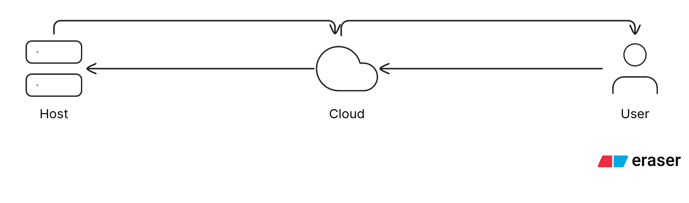

# aegis-tunnel

A secure reverse tunnel for sharing your local development environment.



## How It Works

Aegis Tunnel establishes a secure connection between your local machine and a cloud relay server. This allows external users to access your local development environment through a public URL without exposing your machine directly.

## Usage

### Relay (Cloud Server)

Set the shared secret as an environment variable:

```bash
export AEGIS_SECRET="your-secret-key"
```

Then run the relay:

```bash
python3 -m src.server.relay 
```

### Client (Local Machine)

Run the client with your configuration:

```bash
python3 -m src.client.client --ports 3000 3001 --app app1 app2 --auth "your-secret-key"
```

**Parameters:**
- `--ports`: Local ports to expose 
- `--app`: Public domain for accessing exposed ports
- `--auth`: Secret key (must match `AEGIS_SECRET` on the relay)

The ports will be exposed in the order specified, and each will be accessible through a subdomain.

for example port 3000 will be accessible throw app1 and 3001 accessible throw app2.

the auth is for starting the handshake connection and confirming your identity.